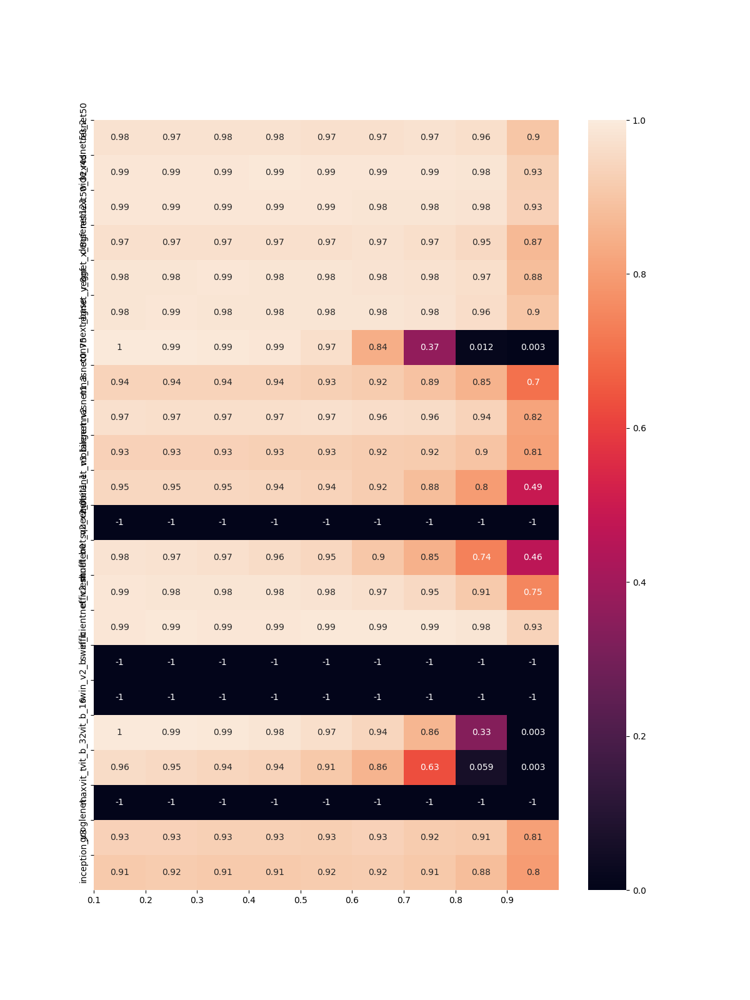

# nn-prune-svd

    Neural network weights prune in a static LoRA–like way -- via SVD.

----

### results

⚠ Not correct, need more investigation




### dataset

The test dataset is 1000 images picked from the validset of ImageNet-1k. 

- download it from [https://pan.quark.cn/s/cf8688f5bca1](https://pan.quark.cn/s/cf8688f5bca1)
- unzip under `/data` folder; the password is `]@vD4S%ojjH6UC#I!b37`, just to avoid content censorship :(

```
data
└── imagenet-1k
    ├── image_name_to_class_id_and_name.json
    └── val
        └── ILSVRC2012_val_*.png
```

### reference

- torch.svd [https://pytorch.org/docs/stable/generated/torch.svd.html](https://pytorch.org/docs/stable/generated/torch.svd.html)
- LoRA: [https://arxiv.org/abs/2106.09685](https://arxiv.org/abs/2106.09685)

----
by Armit
2023/09/04 
